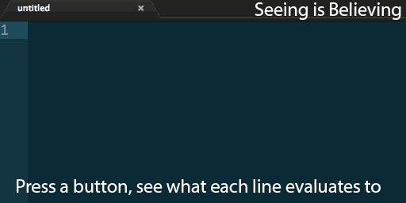

Unix/Mac: 
&nbsp;&nbsp;
Appveyor:  

Seeing Is Believing
===================

Evaluates Ruby code, recording the results of each line.
Integrates with any extensible editor (I've integrated it with many already, see [the list](https://github.com/JoshCheek/seeing_is_believing/wiki/Editor-Integration)).
If you like Swift Playgrounds, you'll like SiB.

Helpful links
-------------

* [Install](https://github.com/JoshCheek/seeing_is_believing/wiki/Installation)
* [Integrate with your editor](https://github.com/JoshCheek/seeing_is_believing/wiki/Editor-Integration)
* [Use as a library](https://github.com/JoshCheek/seeing_is_believing/wiki/Library-example)
* [Use on the command line](https://github.com/JoshCheek/seeing_is_believing/wiki/Command-Line-Usage)
* [Pro Tips (useful patterns)](https://github.com/JoshCheek/seeing_is_believing/wiki/Pro-Tips)
* [Features](https://github.com/JoshCheek/seeing_is_believing/tree/master/features)
* [Potential Future Features](https://github.com/JoshCheek/seeing_is_believing/wiki/Potential-future-features)
* [Set up it up for development work](https://github.com/JoshCheek/seeing_is_believing/wiki/Setting-it-up-for-Development)

Examples
--------

* Watch a [longer video](http://vimeo.com/73866851).
* Watch John Cinnamond use it in a [presentation](http://brightonruby.com/2016/the-point-of-objects-john-cinnamond/)
  at the 10:22 minute mark.
* [Avdi](https://github.com/avdi) uses it in [Ruby Tapas](https://www.rubytapas.com/),
  an amazing resource for developers in general and Ruby Developers in particular!

Known Issues
------------

* Assumes utf-8 everywhere. If this is an issue, please see the [encodings](https://github.com/JoshCheek/seeing_is_believing/wiki/Encodings) section of the wiki.

Inspiration
-----------

* [Xmpfilter](http://www.rubydoc.info/gems/rcodetools/0.8.5.0/Rcodetools/XMPFilter), which is a part of the [rcodetools gem](https://rubygems.org/gems/rcodetools).
* Bret Victor's completely inspiring talk [Inventing on Principle](https://www.youtube.com/watch?v=PUv66718DII).
* My 8th Light mentor, [Doug Bradbury](http://blog.8thlight.com/doug-bradbury/archive.html) who asked me to make it for his Kids Ruby sessions (I don't think we ever finished integrating it, though >.<)

Shout outs
-----------

* Whitequark for all the work on [Parser](http://github.com/whitequark/parser/)

License
-------

    Copyright (C) 2014 Josh Cheek <josh.cheek@gmail.com>

    This program is free software. It comes without any warranty,
    to the extent permitted by applicable law.
    You can redistribute it and/or modify it under the terms of the
    Do What The Fuck You Want To Public License,
    Version 2, as published by Sam Hocevar.
    See http://www.wtfpl.net/ for more details.
